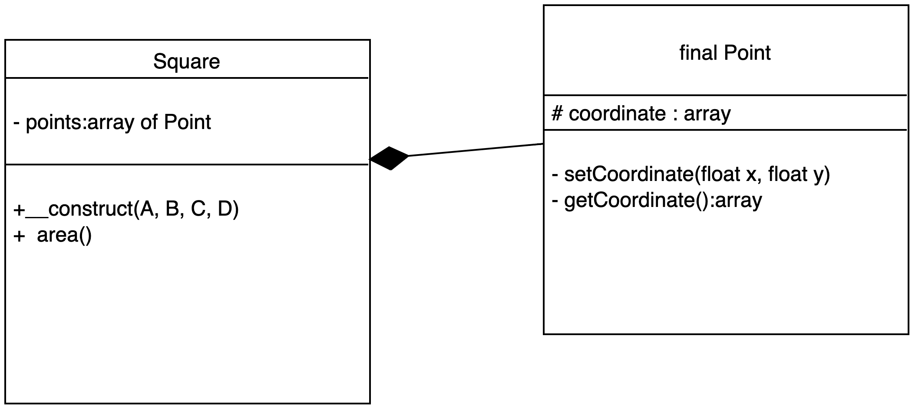

# Introduction

Ce chapitre introduit la notion de relation entre les classes. Dans un prochain chapitre nous aborderons **SOLID** (Single Responsability, Open/Closed, Liskov substitution, Interface segregation, Dependancy injection).

Les relations entre les classes sont importantes à maîtriser pour comprendre SOLID & les **design patterns**. Ils permettent également d'implémenter un code modulable évolutif et testable.

Nous verrons que dans les relations de classe il existe des couplages plus ou moins forts.

## L'héritage (couplage fort)

Il définit un couplage fort. En effet, lorsqu'une classe hérite d'une autre classe, cette classe a besoin de sa classe mère pour "exister" (pour être instanciée).

L’héritage permet de "partager", dans une certaine mesure, un ensemble de méthodes et d’attributs depuis une classe mère avec ses classes filles.

Une classe fille (classe qui hérite d'une autre classe) est une spécialisation d'une classe mère donnée.

Notons que l’héritage multiple n’existe pas en PHP, vous ne pouvez hériter que d’une seule classe à la fois.

### Principe de l'héritage

Pour faire de l’héritage vous devez appliquer le principe suivant : **une classe étendue doit être une sorte de ou est un.**. Par exemple, si vous avez une classe **Book** qui est étendue de la classe **Product**, vous faites bien de l’héritage, car un livre est un produit ou une sorte de produit.


```php
class Product{
    private $name;
    private $price;

    public function setPrice(float $price):void{
        $this->price = $price;
    }

     public function getPrice():float{
        return $this->price;
    }

    // ...
}

class Book extends Product{}
```

La classe Book est une **spécialisation** de la classe Product.

## Classe abstraite

On définit souvent une classe tout en haut de la hiérarchie comme abstraite. Dans cette classe on définit des méthodes générales, mais également des contrats (méthodes abstraites) que les autres classes filles **devront** implémenter (définir).

Une classe est abstraite lorsque au moins une de ses méthodes est abstraite.

Une classe abstraite ne peut être instanciée. Par contre les classes (non abstraites) qui en dérivent (classes filles) sont instanciables.

### Exemple

```php
abstract class Product{
    private $name;
    private $price;

    public function setPrice(float $price):void{
        $this->price = $price;
    }

     public function getPrice():float{
        return $this->price;
    }

    // méthode abstraite
    abstract public function setRef(string ref):void;
}

class Book extends Product{

    // implémentation de la méthode setRef
    public function setRef(string ref):void{
        $this->ref = $ref;
    }
}
```

## Le mot clé final

On peut terminer l'arbre d'héritage par le mot clé "final". La classe finale ne pourra pas avoir de classe fille. Ce mot clé peut également être utilisé pour une méthode, dans ce cas on ne pourra pas la "surcharger" (la re-définir) dans la classe fille.

Rappelons que l'héritage crée un couplage fort entre les classes. On essayera donc de limiter l'arbre d'héritage à une profondeur égale à 3.

```php
abstract class Product{
    protected $name;
    protected $price;

    public function setPrice(float $price):void{
        $this->price = $price;
    }

     public function getPrice():float{
        return $this->price;
    }

    // méthode abstraite
    abstract public function setRef(string ref):void;
}

class Book extends Product{

    // implémentation de la méthode setRef
    public function setRef(string ref):void{
        $this->ref = $ref;
    }
}

final class Science extends Book{
    protected $name ="Mathematic";
}
```

## Exercice Park de Vehicules

Interprétez le diagramme de classe suivant, on vous rappelle les symboles utilisés dans ce dernier :

```text
- private
+ public
# protected

Flèche pointillée : héritage classe abstraite
```


Voici un cas d'utilisation des classes métiers à implémenter :

```php
require __DIR__ . '/vendor/autoload.php';

use Park\Car;
use Park\Plane;

// détermine la vitesse 
Car::setSpeed(180);

// $name 
$kia = new Car('Kia');
$kia->setEngine('electric');

$kia->park('Place de la liberté', 'place : 56A');
$kia->setStatus('stop');

// méthode magique permettant d'afficher les informations
echo  $kia . "\n";
// Name: Kia, Engine: electric, Status: stop, Park address: Place du chateau place: 56A

echo "\n";

// Plane
Plane::setSpeed(890);

// $name 
$plane = new Plane('Airbus A320');
$plane->setEngine('petrol');
$plane->setStatus('flight');

echo $plane . "\n";
```

## Association

C'est une relation entre des classes qui est soit ponctuelle, soit permanente. Elle met en relation des méthodes de classe et pas la classe entière.

### Association permanente

Dès l'instanciation de la classe RaspberryPi l'objet de type Log est nécessaire :

```php

class RaspberryPi{
    
    public function __construct(Log $log){
        $log->log('START...'); // utilisation permanente
    }
}

class Log{
    protected $status;

    public function log(string $status){
        $this->status = $status;
    }
}
```

### Exercice ManageNews (association permanente)

Soient les classes Log et ManageNews. A chaque fois que l'on crée un objet de type ManageNews la méthode statique addLog de la classe Log notifie sa date de création (format d/m/y h:m:s) dans un tableau. 

Utilisez le diagramme suivant pour implémenter les classes :


```php
spl_autoload_register(function ($class) {
    include __DIR__ . '/' . $class . '.php';
});

$n1 = new ManageNews(new Log, "Article PHP");
$n2 = new ManageNews(new Log, "Article MySQL");
$n3 = new ManageNews(new Log, "Article JS");
$n4 = new ManageNews(new Log, "Article MongoDB");
$n5 = new ManageNews(new Log, "Article Python");

var_dump(Log::getStorage());
```

### Association ponctuelle

Dans ce cas une méthode de la classe est dépendante d'une autre classe, mais de manière ponctuelle :

```php
class RaspberryPi{
    
    public function setConnector(Connector $c){
        $c->set(); 
    }

}

class Connector{

    public function set(){
        // 
    }
}
```

L'association peut également être en relation avec l'objet dans lequel elle s'exécute, elle peut être bidirectionnelle.

```php
class RaspberryPiBis{
    
    public function setConnector(Connector $c){
        $c->set($this); 
    }
    
    public function info(){
        return "ARM 132425";
    }

}

class Connector{

    private $os;

    public function set(RaspberryPiBis $raspberry){
        // 
        
        $this->os = $raspberry->info();
    }
}
```

## Agrégation

Une agrégation est une association particulière, elle possède des getter et setter pour agréger l'objet à une classe. Cette relation est moins forte que l'héritage ou la composition (que nous allons voir). La dépendance entre les classes est réalisée si on le souhaite, **principe d'inversion de contrôle**.

```php

class RaspberryPi{
    protected $sd;

    public function memory(){

        return $this->sd ?? 'no memory'; 
    }
    
    public function setSd(Sd $sd){
        $this->sd=$sd;
    }
    
    public function getSd(){
        return $this->sd;
    }

    public function __toString(){
        return $this->memory();
    }
}

// carte sd pour raspberry pi
class Sd{
    
}

$raspberry=new RaspberryPi;
// Dépendance souhaitée
$raspberry->setSd(new Sd);
echo $raspberry;
```

### Exercice Circle & Color

Soient la classe Circle et la classe Color. Un cercle possède une couleur (agrégation). En utilisant le diagramme de classe suivant créez un cercle rouge puis, un cercle bleu.


```php
spl_autoload_register(function ($class) {
    include __DIR__ .'/'.$class.'.php';
});

$circle = new Circle;
$red = new Color('red');
$blue= new Color('blue');

$circle->setColor($red);
echo $circle->getColor()->getName() . "\n"; 

$circle->setColor($blue);
echo $circle->getColor()->getName() . "\n";
```

## Composition

Dans cette relation un objet est contenu dans un autre. Nous n'avons pas ici le "contrôle" de l'objet qui rentre dans la classe. Dans l'exemple qui suit l'objet RaspberryPi est composé d'un objet ARM (l'objet RaspberryPi contient un objet Arm). Cette relation de dépendance entre les classes est forte.

```php
class RaspberryPi{
    protected $arm;
    
    public function __construct(){
        $this->arm = new Arm;
    }
}

// micro precessor
class Arm{
}
```

### Exercice composition

1. Soient la classe Square et la classe Point. Créez un carré en définissant 4 points (0,0), (0,1), (1, 1), (0, 1) dans un repère à deux dimensions. Implémentez le code en suivant le diagramme suivant, la flèche pleine  relie la classe Point à Square. 

*Un carré est composé de 4 points (objet de type Point) exactement.*

2. La méthode area donnera l'aire du carré. 
*Calculez la longueur d'un côté : AB.*


        
```php
spl_autoload_register(function ($class) {
    include __DIR__ . '/' . $class . '.php';
});

$A = new Point(0, 0);
$B = new Point(1, 0);
$C = new Point(1, 1);
$D = new Point(0, 1);

$square = new Square($A, $B, $C, $D);

echo $square->area(); // 1 m2
```

## Implémentation

Cette relation forte existe entre une classe et une interface. Elle définit un **contrat** pour une classe donnée. La classe qui implémente l'interface doit définir ses méthodes.
Une interface doit être définie en utilisant le principe suivant : "à la capacité de" ou "Permet de". 

Une interface n'est pas instanciable. 

Une classe peut implémenter plusieurs interfaces, mais il ne doit pas y avoir de conflit dans les noms des différentes méthodes. 

Chaque méthode d'une interface est publique :

- La définition des contrats est donnée par des méthodes sans corps. C'est à la classe elle-même de définir le corps de chacune des méthodes (contrat).


### Exercice répondez aux questions

Analysez le code qui suit puis répondez aux questions suivantes :

1. Peut-on instancier une interface ?

2. Peut-on oublier certains paramètres des fonctions du contrat (comme price) lors de la définition de cette méthode dans la classe ?

3. La méthode add de la classe Shop type son paramètre. Qu'est ce que cela permet de faire de manière générale ?

```php
interface Productable{

const TVA = .2;

public function price():float;
public function setPrice(float $price):void;
}

class Book implements Productable{
    private $price;

    public function price():float{
        return $this->price * ( Productable::TVA + 1) ;
    }
    public function setPrice(float $price):void{
        $this->price = $price;
    }
}

class Shop {
    private $products = [];

    public function add( Productable $product ){
        $this->products[] = $product;
    }

    public function products(){
    
        foreach($this->products as $product)
            echo $product->getPrice() . "\n";
    }
}

$p1 = new Book();
$p1->setPrice(12);
$p2 = new Book();
$p2->setPrice(2.7);
$p3 = new Book();
$p3->setPrice(20.5);

$shoop = new Shoop();
$shoop->add($p1);
$shoop->add($p2);
$shoop->add($p3);

$shoop->products();
```

*Il existe de nombreuses interfaces pré-définies en PHP, nous les reverrons plus loin dans le cours.*

## Exercice Parking (synthèse)

Créez un dossier Parking avec l'architecture de dossiers et fichiers suivante. Vous pouvez utiliser les classes Vehicule, Car et Plane de l'exercice Park précédent. Définissez un namespace Park de haut niveau (composer.json) :

```txt
Parking/
    src/
        Vehicule.php
        Car.php
        Plane.php
        Bike.php
        Parkable.php
    app.php
    composer.json
```

Vous suivrez le diagramme de classes suivant pour vous aidez à implémenter les classes :


1. Créez les classes **Bike**, **Car** et **Vehicule** puis, créez la classe **Parking**. Un objet de type "Bike" ou "Car" peut se garer dans un parking (objet de type Parking). Ces deux classes sont également de type Vehicule (héritage).

Définissez maintenant l'interface **Parkable** :

- Contrats :
    - park(address:string, place:string)
    - pay(price:float)

La classe Parking possèdera les méthodes suivantes :

- addPark : cette méthode permettra d'ajouter un Objet Parkable
- removePark : cette méthode permettra de "sortir" un Objet Parkable
- count : compte le nombre de mobile(s) garé(s)

*Vous pouvez si vous le souhaitez utiliser la classe SplObjectStorage (clé/valeur) pour enregistrer les objets dans le parking.*

Faites en sorte que seules les classes Bike et Car puissent se garer dans un Parking :

```php
require __DIR__ . '/vendor/autoload.php';

use Park\Car;
use Park\Plane;
use Park\Bike;
use Park\Parking;

Car::setSpeed(180);
Plane::setSpeed(890.5);

$brompton = new Bike('brompton');
$kia = new Car('kia');

$airbus = new Plane('airbus 320');

$parking = new Parking();
$parking->addPark($brompton);
$parking->addPark($kia);
try {
    $parking->addPark($airbus); // exception

} catch (TypeError $e) {
    echo $e->getMessage();
}

echo $parking . "\n";
```

4. Créez la classe Ferry. Elle possède un Parking, c'est également un objet de type Vehicule.

```php
$ferry= new Ferry($parking);

$telsa =new Car('tesla');
$parking->addPark($telsa);
echo $parking . "\n";

```

5. Implémentez une méthode getAll ou __toString dans la classe Parking. Cette méthode affichera le détail des objets qui sont garés dans un parking.


