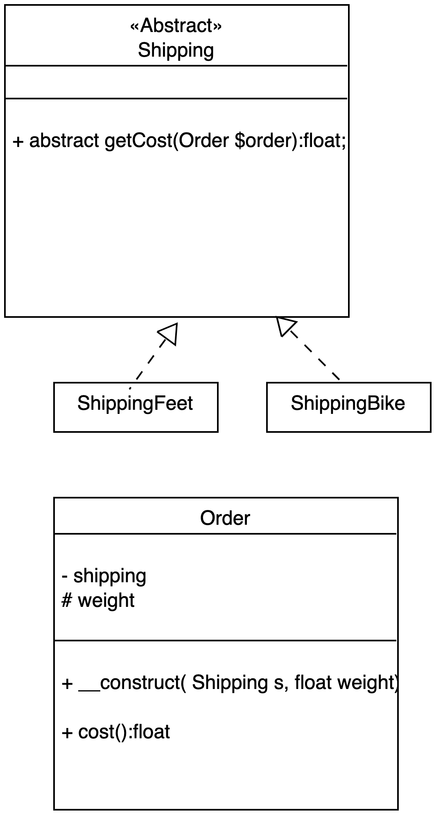
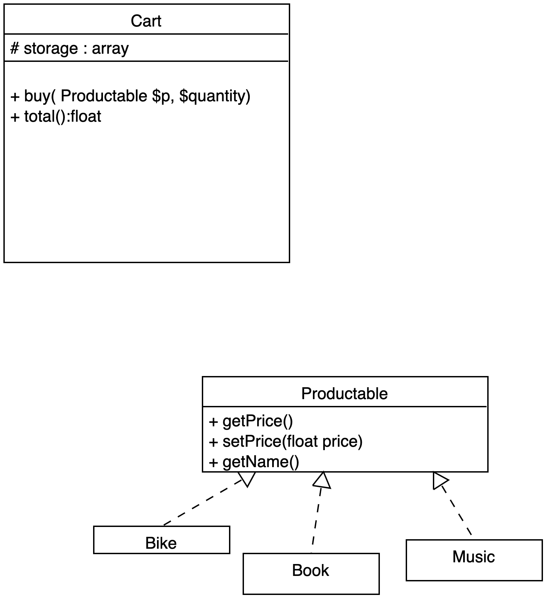
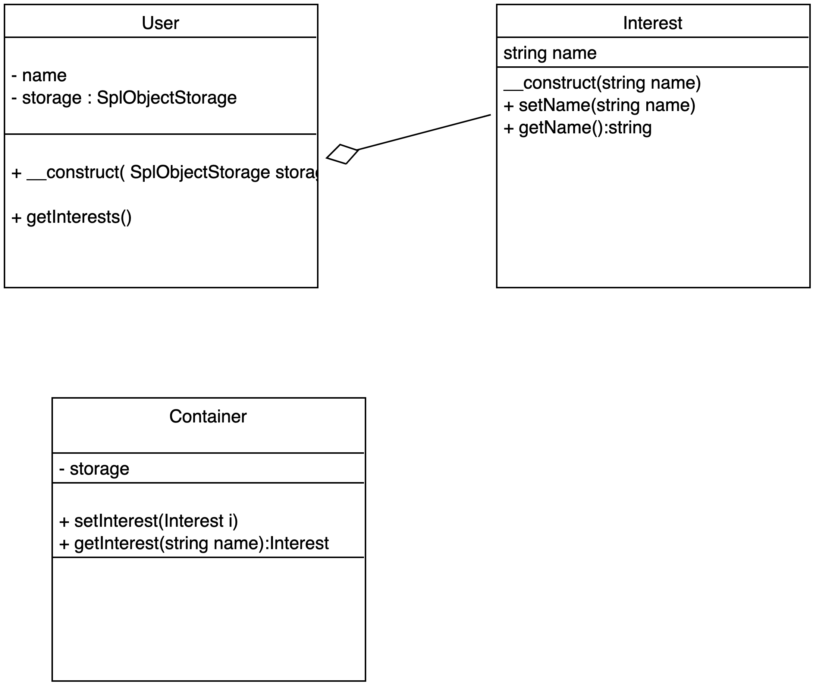
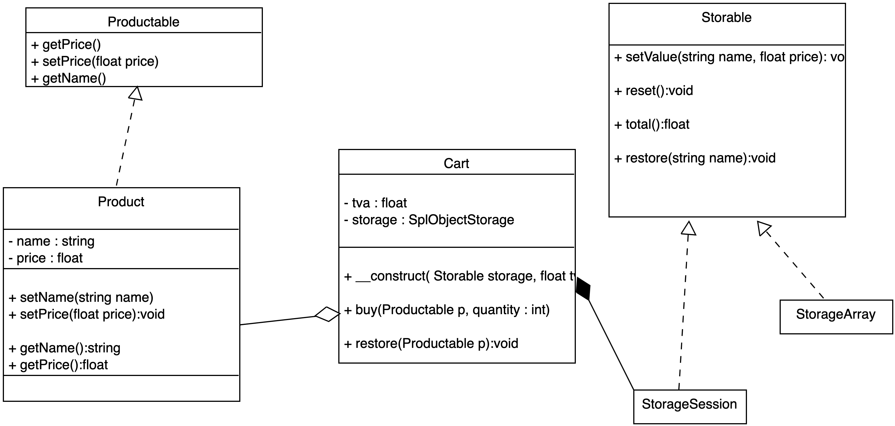

# SOLID

## Présentation du principe SOLID

Les principes S.O.L.I.D. permettent de rendre les applications plus modulables, extensibles et testables. Ils régissent la programmation orientée Objet et permettent de construire des Design Patterns (Observer, Decorator, ...) et Framework (comme Symfony par exemple).

## S.O.L.I.D.

Nous présentons les concepts de S.O.L.I.D. ci-dessous, nous les détaillerons par la suite pour bien les maîtriser en faisant des exercices.

- Single Responsability
*Attribuer des responsabilités limitées uniques et bornées à une classe.*

- Open/Close
*Une classe doit être fermée aux modifications, on ne casse pas le code existant, mais ouverte aux extensions.*

- Liskov substitution
 *Si un objet A se réfère à un objet B, on doit pouvoir substituer B par une de ses classes filles (C par exemple), sans que A n'en soit impacté.*

**Vous pouvez également appliquer la règle suivante. Si vous remplacez une classe parente par une classe enfante alors le comportement général de votre code ne devrait pas en être impacté.**

- Interface segregation
*Un objet A ne doit par "consommer" directement un objet B, il doit consommer son interface.* 

Attention, lorsque vous définissez une interface, celle-ci doit être également **Single Responsability**. Les méthodes définies dans une interface sont des fonctionnalités/responsabilités uniques à implémenter dans la classe. Une interface a donc des responsabilités limitées et uniques et bornées.

*L'objectif de l'interface segregation est de maintenir un couplage faible entre les classes.*

- Dependency injection
*Les classes ne doivent pas créer elles-mêmes les objets dont elles dépendent, on doit les injecter (on crée les instances à l'extérieur de la classe, puis on les "injecte". On ne fait pas de new dans une classe).* 

Ce principe d'inversion est important, un Container de Services prépare les futures instances des classes que l'on pourra injecter dans les classes consommatrices de ces services. Elles sont "injectées" par une/des méthode(s) de la classe.  

## Exercice Single Responsability Lamp

Soit une lampe qui peut s'alumer et s'éteindre... Déterminez deux classes ayant des responsabilités distinctes : Light (on/off) et Lamp et mettez-les en relation.  

Dans cet exercice vous implémenterez une méthode **__toString** dans la classe Lamp pour connaître son état (on ou off). Voyez l'extrait de code ci-dessous :

```php
// code ...
// $lamp est une instance de la classe Lamp
echo $lamp; // Off
$lamp->switch();
echo $lamp; // On
```

## Exercice Tools

Voici une classe ayant trop de responsabilités. Refactorez ce code pour le rendre Single Responsability.

```php
<?php

class Tools
{
    private $format = 'd/m/y';
    private $max = 10;

    public function redirect($url)
    {
        header('Location: ' . $url);
        exit;
    }

    public function date($date)
    {
        return new Date($date)->format($this->format);
    }

    public function token(){

        return random_bytes($this->max);
    }
}

```

## Exercice Open/Closed Shipping

Principe Open/Closed. Ajouter une nouvelle fonctionnalité ne doit pas casser les fonctionnalités existantes. Vous pouvez par exemple, pour respecter ce principe, étendre une classe A par une classe B. La classe B étendue récupère les fonctionnalités de la classe A et peut ainsi ajouter d'autre(s) fonctionnalité(s) sans modifier le code de la classe B.

Soient les classes Shipping, Order, BikeShipping et FeetShipping. Comment mettre en place cette notion de Open/Closed dans ce contexte ? 

Implémentez et définissez les bonnes relations entre ces classes pour répondre à la question. Aidez vous du diagramme de classes et de l'exemple de code suivant pour l'implémenter.



Implémentez la méthode **cost**, elle donnera le coût d'une livraison en fonction du type de livraison (vélo ou à pied) et du poids (attribut de la classe Order).

Une classe fille peut modifier et re-définir/définir des actions sans casser le code de la classe mère.

Aidez-vous du code suivant :

```php

spl_autoload_register(function ($class) {
    include __DIR__ .'/'.$class.'.php';
});

// Livraison Bike
$order = new Order( new ShippingBike, 100 );

echo $order->cost();
echo "\n";

// Livraison Feet
$order = new Order( new ShippingFeet, 100 );

echo $order->cost();
echo "\n";
```

## Questions d'analyse

Nous allons analyser le code ci-dessous et déterminer ce qui pose problème au niveau de sa conception.

Voici deux classes Product et Book, cette dernière hérite de la classe Product. La classe Book surcharge la méthode **priceTTC**.

```php
class Product
{
    public $price;
    public $name ;

    public function __construct(float $price, string $name)
    {
        $this->name = $name;
        $this->price = $price;
    }

    public function priceTTC(float $price, float $tva):float
    {
        return $price * (1 + $tva);
    }
}

class Book extends Product
{
    public function priceTTC(float $price, float $tva, float $taxe):float
    {
         return $price * (1 + $tva) * $taxe;
    }
}
```

La classe Cart permet d'acheter des produits.

```php
class Cart
{
    private $total = 0;
    private $products = [] ;

    public function setProduct( Product $product){
        $this->products[] = $product;
    }

    public function total()
    {
        // calcul du prix total
        foreach($this->products as $product)
            $this->total += $product->priceTTC($product->getPrice(), .2);
    }
}
```

Répondez aux questions suivantes :

1. La classe Book est-elle conforme au principe SOLID ?

Non car **elle brise le principe de Liskov**. Le problème : la méthode priceTTC surchargée possède un paramètre supplémentaire obligatoire. 
Vous pouvez surcharger une méthode dans une classe fille, mais vous devez avoir le même nombre de paramètre(s) que la méthode définie dans la classe mère ainsi que les mêmes types.

Vous pouvez cependant ajouter à la méthode surchargée un paramètre/des paramètres faculatif(s), cela ne brise pas le principe de Liskov.

*Voir l'exemple dans le dossier Examples du cours.*

2. Que se passe-t-il si on ajoute des Book à la classe Cart et que l'on calcule le total des prix TTC ?

Une erreur, car il manque un paramètre dans le calcul du prix TTC pour les Books.

3. Quel principe doit-on appliquer pour coder correctement la classe Book, si on doit surcharger (re-définir) la méthode priceTTC ?

Le principe de substitution de Liskov.

## Exercice Interface ségrégation

Soit une classe Cart. On aimerait pouvoir ajouter dans cette classe des produits différents : Book, Music, Bike,... Sans avoir d'erreur. Implémentez une interface Productable et utilisez-la comme type dans l'injection des produits dans la méthode buy.

Aidez vous du diagramme de classe et du code ci-dessous :



```php

spl_autoload_register(function ($class) {
    include __DIR__ .'/'.$class.'.php';
});

$products = [
    new Book('Moby Dick', 30),
    new Music('AC/DC', 17.5),
    new Bike('Brompton', 1430),
];

$cart = new Cart;

foreach($products as $product)
    $cart->buy($product, 5);

echo  $cart->total()  . "\n";
```

1. Créez un nouveau système de persistance avec un Storage Array .

2. Créez un nouveau système de persistance avec un Storage File.

3. Créez un nouveau système de persistance avec un Storage Session.

Remarques : l'interface permet de fixer le comportement des storages, ils doivent faire persister les données, c'est-à-dire les porduits commandés.

## Exercice Dependency injection

Rappelons que l'on ne doit pas faire de new à l'intérieur d'une classe. Vous devez, à la place, injecter les dépendances en utilisant par exemple de l'agrégation (setter et getter pour l'objet).

Nous verrons également que l'on utilise ce que l'on appelle des containers de services qui préparent les instances de classe que l'on injecte par la suite dans nos classes.

Pour gérer le "storage" des intérets des utilisateurs, vous pouvez utiliser SplObjectStorage de PHP ou un tableau PHP.

1. Soient la classe User et la classe Interest. Implémentez ces deux classes en vous aidant du code ci-dessous :

```php
spl_autoload_register(function ($class) {
    include __DIR__ .'/'.$class.'.php';
});

$storage = new SplObjectStorage;
$alan = new User( $storage );

$python = new Interest('Python');
$alan->setInterest($python);

$php = new Interest('PHP');
$alan->setInterest($php);

$javascript = new Interest('Javascript');
$alan->setInterest($javascript);

echo "\n";
$alan->getInterests();
echo "\n";
```

2. Créez la classe Container. Elle configurera les intérêts des utilisateurs. Aidez vous du diagramme de classe ci-dessous pour implémenter le code.

```php
// Préparer les intérets dans un container de service

$container = new Container( new SplObjectStorage );

$sql = new Interest('SQL');
$container->setStorage($sql, 'SQL');

$alan->setInterest($container->getStorage('SQL'));

$bigdata = new Interest('DATA');
$container->setStorage($bigdata, 'DATA');

$alan->setInterest($container->getStorage('DATA'));

var_dump($container->getStorage('DATA')); // retourne un intéret dans le container

echo "\n";
$alan->getInterests();
echo "\n";
```

Diagramme de classes :



## Exercice Cart synthese

Vous allez maintenant faire un exercice de synthèse sur les concepts SOLID que nous avons abordé.
 
Vous devez appliquer les principes S.O.L.I.D.

Utilisez composer pour l'autoloader. Toutes les classes du projet seront placées dans un dossier src/. 

```text
src/
    Cart.php
    Storable.php
    Productable.php
    Product.php
    StorageArray.php
    StorageSession.php 
app.php
composer.json
```

Dans le fichier **composer.json** vous devez configurer votre autoload comme suit :

```json
"autoload": {
    "psr-4": {
        "": "src/"
    }
}
```

Identifiez bien chaque entité dans le projet en utilsant le diagramme de classe ci-après.

Deux systèmes de persistance seront testés : un StorageArray ou StorageSession.

Le panier est un panier d'un magazin bio vendant des fruits, créez
quelques produits pour tester vos méthodes.

Aidez vous également du code ci-dessous pour créer ce panier.

- Diagramme de classe



- Exemple d'utilisation du code

```php

require_once __DIR__ . '/vendor/autoload.php';

// création des produits
$products = [
    'apple' => new Product('apple', 10.5),
    'raspberry' => new Product('raspberry', 13),
    'strawberry' => new Product('strawberry', 7.5),
    'orange' => new Product('orange', 7.5),
];

$storageSession =  new StorageSession; // persistance en Session
$storageArray =  new storageArray; // utilisation pour les tests
$storageDB =  new StorageDB; // persistance en DB
$storageFile =  new StorageFile; // persistance dans un fichier

// $cart = new Cart($storageSession);

$cart = new Cart($storageArray);

extract($products);

$cart->buy($apple, 3);
$cart->buy($apple, 4);
$cart->buy($apple, 5);
$cart->buy($strawberry, 10);

echo "\n";
echo $cart->total() ; // 241.2
echo "\n";

// retire un produit du panier
echo "restore" . "\n";
$cart->restore($strawberry);

echo "\n";
echo $cart->total() ; // 151.2
echo "\n";
```

## Question 01 

1. Que pensez-vous de la classe suivante ? Si celle-ci est non conforme, proposez une solution de refactorisation du code (codez la solution dans un fichier).

```php
class User {
  
    public function __construct(private string $name, private int $age){

    }
    
    // ...
    
    public function store() {
        // Store attributes into a database...
    }
}
```

La classe User a trop de responsabilités, le store doit se trouver dans une classe de type **Repository** (traitement base de données).

```php
class User {
  
    public function __construct(private string $name, private int $age){

    }
}

// Repository pour traiter les données en BD.
class UserRepository
{

    public function store(User $user)
    {
        // Store the user into a database...
    }
}

```

## Question 02

Voici deux classes Géométriques :

```php
class Rectangle {
    public function __construct(
        private float $w, 
        private float $h
    ) {}
}

class Square {
  
    public function __construct(private float $c) {
    }
}
```

Un étudiant propose la solution suivante pour calculer la somme des aires de chaque forme géométrique. Qu'est-ce que vous seriez tenté de lui dire si par exemple on introduit une nouvelle classe Circle dans le projet ?

Proposez une solution (codez-la dans un fichier) pour résoudre ce problème et explicitez le terme SOLID utilisé.

```php
class Area {
  
    public function __construct(
        private array $shapes = []
    ) {}
    
    public function sum() {
        foreach($this->shapes as $shape) {
            if($shape instanceof Square) {
                $area[] = ($shape->c)**2;
            } else if($shape instanceof Rectangle) {
                $area[] = $shape->w * $shape->h;
            }
        }
    
        return array_sum($area);
    }
}
```

|Elle n'est pas ouverte à l'extension du code. On est clairement obligé de casser le code pour la faire évoluer. Le principe Open/closed est à rappeler à l'étudiant.|

```php

interface Calculable
{
    const PI = 3.14;
    const PRECISION_DECIMAL = 2;

    public function area():float;
}

class Rectangle implements Calculable
{
    public function __construct(
        private float $w,
        private float $h
    ) {
    }

    public function area():float
    {
        return round ( $this->w * $this->h, self::PRECISION_DECIMAL) ;
    }
}

class Square implements Calculable
{

    public function __construct(private float $c)
    {
    }

    public function area():float
    {
        return round (  ($this->c) ** 2, self::PRECISION_DECIMAL) ;
    }
}

class Circle implements Calculable
{

    
    public function __construct(private float $r)
    {
    }

    public function area():float
    {
        return round( self::PI * ($this->r) ** 2, PRECISION_DECIMAL);
    }
}

class Area
{
    const PRECISION_DECIMAL = 2;

    public function __construct(
        private array $shapes = []
    ) {
    }

    public function sum()
    {

        foreach ($this->shapes as $shape) $area[] = $shape->area();

        return round( array_sum($this->shapes), PRECISION_DECIMAL) ;
    }
}
```

## Question 03

1. Que pensez-vous de la substitution ci-dessous, est-elle sans risque ? Nous remplaçons une classe parente par une classe enfante. Quel principe à votre avis avons nous brisé ?


```php

class Feline
{
    public function speak():string{

        return "grrr";
    }
}

class Cat extends Feline
{
    public $behviour;

    public function sleep():string{

        return "a lot";
    }

    // ICI on brise le principe de Liskov en changent la signature de la méthode speak
    public function speak():void{

        $this->behviour = "grrr";
    }
}

class CatInfo 
{

    public function info(Feline $cat)
    {

        return $cat->speak();
    }
}

class SubCatInfo 
{

    public function info(Cat $cat)
    {
        return $cat->speak();
    }
}
```

2. Le principe suivant vous paraît-il cohérent, si oui, à quelle notion dans SOLID fait-il référence ? 

|Principe : "Si vous remplacez une classe parente par une classe enfante, alors le comportement général de votre code ne devrait pas en être impacté."|

C'est le principe de Liskov.

3. Dans l'exercice Book et Product dans le cours, nous avons remplacé une classe parente Product par une classe enfante Book. Quel problème avons-nous alors rencontré ?

|On a cassé le code de l'application.|

## Exercice Form création de formulaire à la volée

On vous demande de développer un composant **ComponentForm** très simple pour générer des formulaires à la volée. On souhaiterait avoir un champ de formulaire de type number, password et text. 

Faites un schéma pour expliciter votre projet avant de l'implémenter.

```bash

php -S localhost:8000 app.php

```

On affichera le formulaire :

```txt
FirsName : []
LastName : []
age : []
password : []

[Valider]
```

## Remarques sur la conception SOLID

```php

class Cart{

    /*
    * La signature SessionStorage ne permet pas la modularité vous devez utiliser un type Storable plus modulable
    */
    public function __construct(SessionStorage $storage){
        $this->storage = $storage;
    }

// ...

    public function (Productable $p, int $q){

// ...
//      On attribut trop de responsabilités à la classe Cart PENSEZ SINGLE RESPONSABILITY toujours ! Ce n'est pas la responsabilité de la classe Cart de s'occuper du storage
      //  $this->storage[$p->getName()] += $p->getPrice() * $q ;

        $this->storage->setValue($p->getName(), $p->getPrice() * $q);
    }
}


// Ne pas faire ce qui suit !!!! Ce n'est pas modulable travailler avec des interfaces ! Pour éviter 

class CartSession {

}

class CartDB {
    
}

```

## Rappels de code 


```php
class Product
{
    public function __construct(
        private string $name, 
        private float $price
    ) {}
}
```